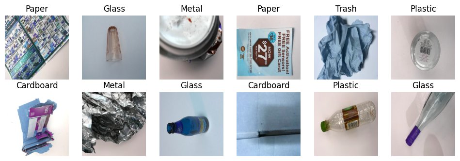
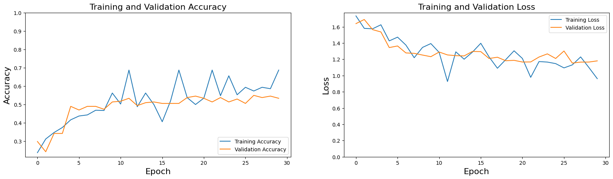
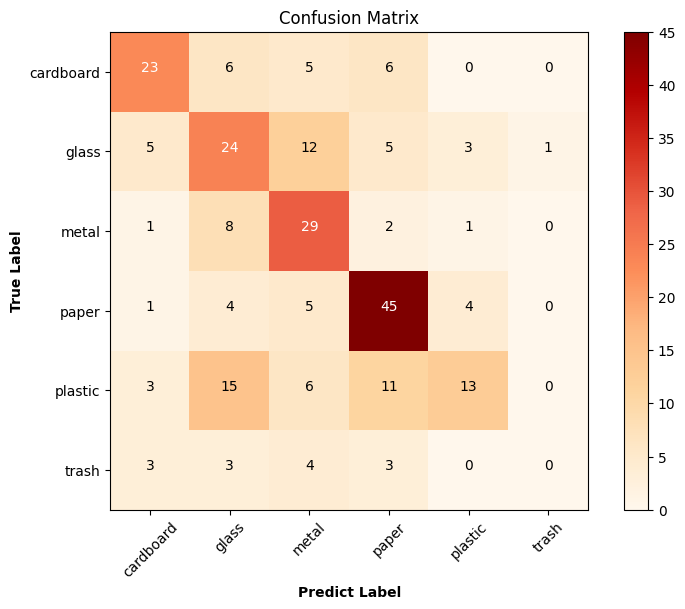
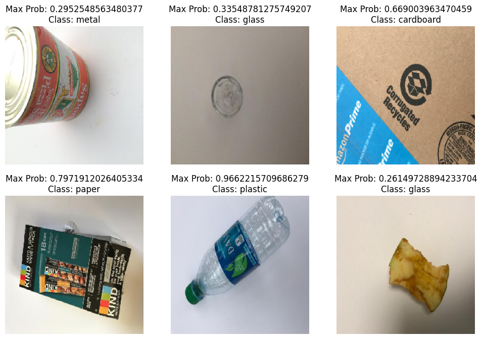

# Garbage Classification with Convolutional Neural Network (CNN)

## Connecting Google Colab to Google Drive


```python
from google.colab import drive
drive.mount('/content/drive')
```

    Mounted at /content/drive


# Solid Waste Detection with Convolutional Neural Networks (CNN)

1) Business Problem

2) Data Understanding

3) Data Preparation

4) Modelling

5) Evaluation

# 1) Business Problem

# 2) Data Understanding

## Dataset Story

The data set we will use in this project is TrashNet. It was prepared by Stanaford University students. The dataset consists of six different classes. There are a total of 2527 images in the dataset, including Glass, Paper, Cardboard, Plastic, Metal and Garbage.

Distribution of images:

- 501 glasses
- 594 paper
- 403 cardboard
- 482 plastic
- 410 metal
- 137 trash


The images were taken by placing them on a white board and using sunlight or room lighting. The images have a size of 512x384 pixels and 3 (RGB) channels.

## 2.1) Import Operations of Required Libraries


```python
# Import the necessary libraries
import cv2
import urllib
import itertools
import numpy as np
import pandas as pd
import seaborn as sns
import random, os, glob
from imutils import paths
import matplotlib.pyplot as plt
from sklearn.utils import shuffle
from urllib.request import urlopen
from sklearn.metrics import classification_report
from sklearn.metrics import confusion_matrix

# It is used to switch off warnings.
import warnings
warnings.filterwarnings('ignore')

# Libraries to be used for the model
import tensorflow as tf
from tensorflow.keras.models import Sequential
from tensorflow.keras.preprocessing import image
from tensorflow.keras.utils import to_categorical
from tensorflow.keras.callbacks import ModelCheckpoint, EarlyStopping
from tensorflow.keras.layers import Conv2D, Flatten, MaxPooling2D, Dense, Dropout, SpatialDropout2D
from tensorflow.keras.preprocessing.image import ImageDataGenerator, img_to_array, load_img, array_to_img
```


```python
!pip install imutils
```

    Requirement already satisfied: imutils in /usr/local/lib/python3.10/dist-packages (0.5.4)


## 2.2) Reading the Data Set


1. Pairing the Google Colab Notebook with the Google Drive account.
2. Upload the data set to Google Drive and show the address to the notebook
3. Defining the function to read the data set.


```python
# Keeping the path information of the images in this data set in the drive
dir_path = '/content/drive/MyDrive/Garbage-Classification'
```


```python
# Determining Target size and Label Label Values

target_size = (224, 224)

waste_labels = {'cardboard': 0, 'glass': 1, 'metal': 2, 'paper': 3, 'plastic': 4, 'trash': 5}
```


```python
def load_datasets(path):

# Reads the image from the directory of images and creates the tags.

# Parameters

# path: The directory where the images are located.

# return:

# x: List holding the class information to which the images belong.

  x = []
  labels = []

  # It lists and sorts the images in the path we send.
  image_paths = sorted(list(paths.list_images(path)))

  for image_path in image_paths:
    # The images in the specified path are read with the openCV library.
    img = cv2.imread(image_path)

    # The read images are rescaled according to the initially specified target_size.
    img = cv2.resize(img, target_size)

    # Scaled images are added to the x list.
    x.append(img)

    # When each path is separated by '/', the second to last element of the returned list represents the label.
    label = image_path.split(os.path.sep)[-2]

    # A label is created by taking the value value corresponding to the key value sent from the waste_labels dictionary, which contains the numeric value equivalents of the captured labels.
    labels.append(waste_labels[label])

    # The data set is randomly shuffled.
    x, labels = shuffle(x, labels, random_state = 42)

  # Size and class information is reported.
  print(f"X size: {np.array(x).shape}")
  print(f"Label class number: {len(np.unique(labels))} Number of observations: {len(labels)}")

  return x, labels
```


```python
x, labels = load_datasets(dir_path)
```

    X size: (2527, 224, 224, 3)
    Label class number: 6 Number of observations: 2527


```python
# Retention of image sizes
input_shape = (np.array(x[0]).shape[1],np.array(x[0]).shape[1], 3)
print(input_shape)
```

    (224, 224, 3)


## 2.3) Showing Examples from the Data Set


```python
def visualize_img(image_batch, label_batch):

# The image is visualised from the data set.

# Parameters

# image_batch: Holds the martrix information of the images.

# label_batch: List holding the class information of the image.

  plt.figure(figsize=(12, 12))
  for n in range(12):
    ax = plt.subplot(6,6,n+1)
    plt.imshow(image_batch[n])
    plt.title(np.array(list(waste_labels.keys()))[to_categorical(labels, num_classes=6)[n]==1][0].title())
    plt.axis('off')
```


```python
visualize_img(x, labels)
```


    

    


# 3 Data Preparation


```python
# We define a generator for the Train dataset.
train = ImageDataGenerator(horizontal_flip=True,
                           vertical_flip=True,
                           validation_split=0.1,
                           rescale=1./255,
                           shear_range = 0.1,
                           zoom_range = 0.1,
                           width_shift_range= 0.1,
                           height_shift_range = 0.1)

# We define a generator for the test data set.
test = ImageDataGenerator(rescale=1/255,
                          validation_split=0.1)
```


```python
train_generator=train.flow_from_directory(directory=dir_path,
                                          target_size=(target_size),
                                          class_mode='categorical',
                                          subset='training')

test_generator=test.flow_from_directory(directory=dir_path,
                                        target_size=(target_size),
                                        batch_size=251,
                                        class_mode='categorical',
                                        subset='validation')
```

    Found 2276 images belonging to 6 classes.
    Found 251 images belonging to 6 classes.


# 4) Modeling

## 4.1) Building a CNN Model from Scratch

- Sequential
- Convolution Layer (Convolotion Layer, Conv2D)
- Pooling Layer
- Activation Function Layer (Activation Layer)
- Flattening Layer
- Dense Layer
- Dropout Layer


```python
model=Sequential()
model.add(Conv2D(filters=32, kernel_size=(3,3), padding='same', input_shape=(input_shape), activation='relu'))
model.add(MaxPooling2D(pool_size=2, strides=(2,2)))

model.add(Conv2D(filters=64, kernel_size=(3,3), padding='same', input_shape=(input_shape), activation='relu'))
model.add(MaxPooling2D(pool_size=2, strides=(2,2)))

model.add(Conv2D(filters=32, kernel_size=(3,3), padding='same', input_shape=(input_shape), activation='relu'))
model.add(MaxPooling2D(pool_size=2, strides=(2,2)))

model.add(Flatten())

model.add(Dense(units=64, activation='relu'))
model.add(Dropout(rate=0.2))

model.add(Dense(units=32, activation='relu'))
model.add(Dropout(rate=0.2))

model.add(Dense(units=6, activation='softmax'))
```

## 4.2) Model Summary


```python
model.summary()
```


<pre style="white-space:pre;overflow-x:auto;line-height:normal;font-family:Menlo,'DejaVu Sans Mono',consolas,'Courier New',monospace"><span style="font-weight: bold">Model: "sequential"</span>
</pre>


<pre style="white-space:pre;overflow-x:auto;line-height:normal;font-family:Menlo,'DejaVu Sans Mono',consolas,'Courier New',monospace">┏━━━━━━━━━━━━━━━━━━━━━━━━━━━━━━━━━━━━━━┳━━━━━━━━━━━━━━━━━━━━━━━━━━━━━┳━━━━━━━━━━━━━━━━━┓
┃<span style="font-weight: bold"> Layer (type)                         </span>┃<span style="font-weight: bold"> Output Shape                </span>┃<span style="font-weight: bold">         Param # </span>┃
┡━━━━━━━━━━━━━━━━━━━━━━━━━━━━━━━━━━━━━━╇━━━━━━━━━━━━━━━━━━━━━━━━━━━━━╇━━━━━━━━━━━━━━━━━┩
│ conv2d (<span style="color: #0087ff; text-decoration-color: #0087ff">Conv2D</span>)                      │ (<span style="color: #00d7ff; text-decoration-color: #00d7ff">None</span>, <span style="color: #00af00; text-decoration-color: #00af00">224</span>, <span style="color: #00af00; text-decoration-color: #00af00">224</span>, <span style="color: #00af00; text-decoration-color: #00af00">32</span>)        │             <span style="color: #00af00; text-decoration-color: #00af00">896</span> │
├──────────────────────────────────────┼─────────────────────────────┼─────────────────┤
│ max_pooling2d (<span style="color: #0087ff; text-decoration-color: #0087ff">MaxPooling2D</span>)         │ (<span style="color: #00d7ff; text-decoration-color: #00d7ff">None</span>, <span style="color: #00af00; text-decoration-color: #00af00">112</span>, <span style="color: #00af00; text-decoration-color: #00af00">112</span>, <span style="color: #00af00; text-decoration-color: #00af00">32</span>)        │               <span style="color: #00af00; text-decoration-color: #00af00">0</span> │
├──────────────────────────────────────┼─────────────────────────────┼─────────────────┤
│ conv2d_1 (<span style="color: #0087ff; text-decoration-color: #0087ff">Conv2D</span>)                    │ (<span style="color: #00d7ff; text-decoration-color: #00d7ff">None</span>, <span style="color: #00af00; text-decoration-color: #00af00">112</span>, <span style="color: #00af00; text-decoration-color: #00af00">112</span>, <span style="color: #00af00; text-decoration-color: #00af00">64</span>)        │          <span style="color: #00af00; text-decoration-color: #00af00">18,496</span> │
├──────────────────────────────────────┼─────────────────────────────┼─────────────────┤
│ max_pooling2d_1 (<span style="color: #0087ff; text-decoration-color: #0087ff">MaxPooling2D</span>)       │ (<span style="color: #00d7ff; text-decoration-color: #00d7ff">None</span>, <span style="color: #00af00; text-decoration-color: #00af00">56</span>, <span style="color: #00af00; text-decoration-color: #00af00">56</span>, <span style="color: #00af00; text-decoration-color: #00af00">64</span>)          │               <span style="color: #00af00; text-decoration-color: #00af00">0</span> │
├──────────────────────────────────────┼─────────────────────────────┼─────────────────┤
│ conv2d_2 (<span style="color: #0087ff; text-decoration-color: #0087ff">Conv2D</span>)                    │ (<span style="color: #00d7ff; text-decoration-color: #00d7ff">None</span>, <span style="color: #00af00; text-decoration-color: #00af00">56</span>, <span style="color: #00af00; text-decoration-color: #00af00">56</span>, <span style="color: #00af00; text-decoration-color: #00af00">32</span>)          │          <span style="color: #00af00; text-decoration-color: #00af00">18,464</span> │
├──────────────────────────────────────┼─────────────────────────────┼─────────────────┤
│ max_pooling2d_2 (<span style="color: #0087ff; text-decoration-color: #0087ff">MaxPooling2D</span>)       │ (<span style="color: #00d7ff; text-decoration-color: #00d7ff">None</span>, <span style="color: #00af00; text-decoration-color: #00af00">28</span>, <span style="color: #00af00; text-decoration-color: #00af00">28</span>, <span style="color: #00af00; text-decoration-color: #00af00">32</span>)          │               <span style="color: #00af00; text-decoration-color: #00af00">0</span> │
├──────────────────────────────────────┼─────────────────────────────┼─────────────────┤
│ flatten (<span style="color: #0087ff; text-decoration-color: #0087ff">Flatten</span>)                    │ (<span style="color: #00d7ff; text-decoration-color: #00d7ff">None</span>, <span style="color: #00af00; text-decoration-color: #00af00">25088</span>)               │               <span style="color: #00af00; text-decoration-color: #00af00">0</span> │
├──────────────────────────────────────┼─────────────────────────────┼─────────────────┤
│ dense (<span style="color: #0087ff; text-decoration-color: #0087ff">Dense</span>)                        │ (<span style="color: #00d7ff; text-decoration-color: #00d7ff">None</span>, <span style="color: #00af00; text-decoration-color: #00af00">64</span>)                  │       <span style="color: #00af00; text-decoration-color: #00af00">1,605,696</span> │
├──────────────────────────────────────┼─────────────────────────────┼─────────────────┤
│ dropout (<span style="color: #0087ff; text-decoration-color: #0087ff">Dropout</span>)                    │ (<span style="color: #00d7ff; text-decoration-color: #00d7ff">None</span>, <span style="color: #00af00; text-decoration-color: #00af00">64</span>)                  │               <span style="color: #00af00; text-decoration-color: #00af00">0</span> │
├──────────────────────────────────────┼─────────────────────────────┼─────────────────┤
│ dense_1 (<span style="color: #0087ff; text-decoration-color: #0087ff">Dense</span>)                      │ (<span style="color: #00d7ff; text-decoration-color: #00d7ff">None</span>, <span style="color: #00af00; text-decoration-color: #00af00">32</span>)                  │           <span style="color: #00af00; text-decoration-color: #00af00">2,080</span> │
├──────────────────────────────────────┼─────────────────────────────┼─────────────────┤
│ dropout_1 (<span style="color: #0087ff; text-decoration-color: #0087ff">Dropout</span>)                  │ (<span style="color: #00d7ff; text-decoration-color: #00d7ff">None</span>, <span style="color: #00af00; text-decoration-color: #00af00">32</span>)                  │               <span style="color: #00af00; text-decoration-color: #00af00">0</span> │
├──────────────────────────────────────┼─────────────────────────────┼─────────────────┤
│ dense_2 (<span style="color: #0087ff; text-decoration-color: #0087ff">Dense</span>)                      │ (<span style="color: #00d7ff; text-decoration-color: #00d7ff">None</span>, <span style="color: #00af00; text-decoration-color: #00af00">6</span>)                   │             <span style="color: #00af00; text-decoration-color: #00af00">198</span> │
└──────────────────────────────────────┴─────────────────────────────┴─────────────────┘
</pre>


<pre style="white-space:pre;overflow-x:auto;line-height:normal;font-family:Menlo,'DejaVu Sans Mono',consolas,'Courier New',monospace"><span style="font-weight: bold"> Total params: </span><span style="color: #00af00; text-decoration-color: #00af00">1,645,830</span> (6.28 MB)
</pre>


<pre style="white-space:pre;overflow-x:auto;line-height:normal;font-family:Menlo,'DejaVu Sans Mono',consolas,'Courier New',monospace"><span style="font-weight: bold"> Trainable params: </span><span style="color: #00af00; text-decoration-color: #00af00">1,645,830</span> (6.28 MB)
</pre>


<pre style="white-space:pre;overflow-x:auto;line-height:normal;font-family:Menlo,'DejaVu Sans Mono',consolas,'Courier New',monospace"><span style="font-weight: bold"> Non-trainable params: </span><span style="color: #00af00; text-decoration-color: #00af00">0</span> (0.00 B)
</pre>


## 4.3) Setting Optimisation and Evaluation Metrics


```python
model.compile(loss='categorical_crossentropy',
              optimizer='adam',
              metrics=[tf.keras.metrics.Precision(), tf.keras.metrics.Recall(), "acc"])
```


```python
callbacks = [EarlyStopping(monitor='val_loss', patience=50, verbose=1, mode="min"),

             ModelCheckpoint(filepath='mymodel.keras', monitor='val_loss', mode='min', save_best_only=True, save_weights_only=False, verbose=1)]
```

## 4.4) Training the Model


```python
history = model.fit(train_generator,
                    epochs=30,
                    validation_data=test_generator,
                    callbacks=callbacks,
                    steps_per_epoch=2276//32,
                    validation_steps=251//32)
```

    Epoch 1/30
    71/71 ━━━━━━━━━━━━━━━━━━━━ 0s 481ms/step - acc: 0.2285 - loss: 1.7641 - precision: 0.2808 - recall: 0.0068
    Epoch 1: val_loss improved from inf to 1.63878, saving model to mymodel.keras
    71/71 ━━━━━━━━━━━━━━━━━━━━ 66s 616ms/step - acc: 0.2286 - loss: 1.7637 - precision: 0.2825 - recall: 0.0068 - val_acc: 0.2988 - val_loss: 1.6388 - val_precision: 0.8571 - val_recall: 0.0239
    Epoch 2/30
     1/71 ━━━━━━━━━━━━━━━━━━━━ 2s 36ms/step - acc: 0.3125 - loss: 1.5804 - precision: 0.5000 - recall: 0.0312
    Epoch 2: val_loss did not improve from 1.63878
    71/71 ━━━━━━━━━━━━━━━━━━━━ 1s 18ms/step - acc: 0.3125 - loss: 1.5804 - precision: 0.5000 - recall: 0.0312 - val_acc: 0.2430 - val_loss: 1.6896 - val_precision: 0.9286 - val_recall: 0.0518
    Epoch 3/30
    71/71 ━━━━━━━━━━━━━━━━━━━━ 0s 453ms/step - acc: 0.3150 - loss: 1.6333 - precision: 0.4312 - recall: 0.0439
    Epoch 3: val_loss improved from 1.63878 to 1.56500, saving model to mymodel.keras
    71/71 ━━━━━━━━━━━━━━━━━━━━ 57s 473ms/step - acc: 0.3154 - loss: 1.6325 - precision: 0.4338 - recall: 0.0445 - val_acc: 0.3426 - val_loss: 1.5650 - val_precision: 0.5294 - val_recall: 0.1076
    Epoch 4/30
     1/71 ━━━━━━━━━━━━━━━━━━━━ 2s 39ms/step - acc: 0.3750 - loss: 1.6246 - precision: 0.5000 - recall: 0.1250
    Epoch 4: val_loss improved from 1.56500 to 1.53631, saving model to mymodel.keras
    71/71 ━━━━━━━━━━━━━━━━━━━━ 1s 20ms/step - acc: 0.3750 - loss: 1.6246 - precision: 0.5000 - recall: 0.1250 - val_acc: 0.3426 - val_loss: 1.5363 - val_precision: 0.6000 - val_recall: 0.1076
    Epoch 5/30
    70/71 ━━━━━━━━━━━━━━━━━━━━ 0s 466ms/step - acc: 0.3863 - loss: 1.4515 - precision: 0.6554 - recall: 0.1565
    Epoch 5: val_loss improved from 1.53631 to 1.34416, saving model to mymodel.keras
    71/71 ━━━━━━━━━━━━━━━━━━━━ 38s 479ms/step - acc: 0.3872 - loss: 1.4508 - precision: 0.6557 - recall: 0.1569 - val_acc: 0.4900 - val_loss: 1.3442 - val_precision: 0.7541 - val_recall: 0.1833
    Epoch 6/30
     1/71 ━━━━━━━━━━━━━━━━━━━━ 2s 38ms/step - acc: 0.4375 - loss: 1.4724 - precision: 0.5833 - recall: 0.2188
    Epoch 6: val_loss did not improve from 1.34416
    71/71 ━━━━━━━━━━━━━━━━━━━━ 2s 29ms/step - acc: 0.4375 - loss: 1.4724 - precision: 0.5833 - recall: 0.2188 - val_acc: 0.4701 - val_loss: 1.3638 - val_precision: 0.7667 - val_recall: 0.1833
    Epoch 7/30
    70/71 ━━━━━━━━━━━━━━━━━━━━ 0s 502ms/step - acc: 0.4406 - loss: 1.3864 - precision: 0.6929 - recall: 0.1908
    Epoch 7: val_loss improved from 1.34416 to 1.27833, saving model to mymodel.keras
    71/71 ━━━━━━━━━━━━━━━━━━━━ 40s 518ms/step - acc: 0.4406 - loss: 1.3861 - precision: 0.6926 - recall: 0.1907 - val_acc: 0.4900 - val_loss: 1.2783 - val_precision: 0.7763 - val_recall: 0.2351
    Epoch 8/30
     1/71 ━━━━━━━━━━━━━━━━━━━━ 2s 37ms/step - acc: 0.4688 - loss: 1.2193 - precision: 0.8182 - recall: 0.2812
    Epoch 8: val_loss improved from 1.27833 to 1.27312, saving model to mymodel.keras
    71/71 ━━━━━━━━━━━━━━━━━━━━ 1s 21ms/step - acc: 0.4688 - loss: 1.2193 - precision: 0.8182 - recall: 0.2812 - val_acc: 0.4900 - val_loss: 1.2731 - val_precision: 0.7284 - val_recall: 0.2351
    Epoch 9/30
    70/71 ━━━━━━━━━━━━━━━━━━━━ 0s 451ms/step - acc: 0.4758 - loss: 1.3400 - precision: 0.6876 - recall: 0.2318
    Epoch 9: val_loss improved from 1.27312 to 1.25208, saving model to mymodel.keras
    71/71 ━━━━━━━━━━━━━━━━━━━━ 36s 464ms/step - acc: 0.4755 - loss: 1.3402 - precision: 0.6875 - recall: 0.2311 - val_acc: 0.4741 - val_loss: 1.2521 - val_precision: 0.7831 - val_recall: 0.2590
    Epoch 10/30
     1/71 ━━━━━━━━━━━━━━━━━━━━ 2s 36ms/step - acc: 0.5625 - loss: 1.3933 - precision: 0.8571 - recall: 0.3750
    Epoch 10: val_loss improved from 1.25208 to 1.23198, saving model to mymodel.keras
    71/71 ━━━━━━━━━━━━━━━━━━━━ 3s 39ms/step - acc: 0.5625 - loss: 1.3933 - precision: 0.8571 - recall: 0.3750 - val_acc: 0.5139 - val_loss: 1.2320 - val_precision: 0.7619 - val_recall: 0.2550
    Epoch 11/30
    71/71 ━━━━━━━━━━━━━━━━━━━━ 0s 449ms/step - acc: 0.4885 - loss: 1.2907 - precision: 0.7181 - recall: 0.2690
    Epoch 11: val_loss did not improve from 1.23198
    71/71 ━━━━━━━━━━━━━━━━━━━━ 37s 468ms/step - acc: 0.4887 - loss: 1.2906 - precision: 0.7182 - recall: 0.2691 - val_acc: 0.5179 - val_loss: 1.2893 - val_precision: 0.6667 - val_recall: 0.2311
    Epoch 12/30
     1/71 ━━━━━━━━━━━━━━━━━━━━ 2s 37ms/step - acc: 0.6875 - loss: 0.9264 - precision: 0.8462 - recall: 0.3438
    Epoch 12: val_loss did not improve from 1.23198
    71/71 ━━━━━━━━━━━━━━━━━━━━ 1s 18ms/step - acc: 0.6875 - loss: 0.9264 - precision: 0.8462 - recall: 0.3438 - val_acc: 0.5339 - val_loss: 1.2536 - val_precision: 0.7308 - val_recall: 0.2271
    Epoch 13/30
    70/71 ━━━━━━━━━━━━━━━━━━━━ 0s 459ms/step - acc: 0.5104 - loss: 1.2583 - precision: 0.7330 - recall: 0.2811
    Epoch 13: val_loss did not improve from 1.23198
    71/71 ━━━━━━━━━━━━━━━━━━━━ 40s 471ms/step - acc: 0.5098 - loss: 1.2592 - precision: 0.7322 - recall: 0.2807 - val_acc: 0.4940 - val_loss: 1.2446 - val_precision: 0.7595 - val_recall: 0.2390
    Epoch 14/30
     1/71 ━━━━━━━━━━━━━━━━━━━━ 3s 43ms/step - acc: 0.5625 - loss: 1.2009 - precision: 0.8889 - recall: 0.2500
    Epoch 14: val_loss did not improve from 1.23198
    71/71 ━━━━━━━━━━━━━━━━━━━━ 1s 19ms/step - acc: 0.5625 - loss: 1.2009 - precision: 0.8889 - recall: 0.2500 - val_acc: 0.5100 - val_loss: 1.2416 - val_precision: 0.7561 - val_recall: 0.2470
    Epoch 15/30
    70/71 ━━━━━━━━━━━━━━━━━━━━ 0s 456ms/step - acc: 0.5124 - loss: 1.2504 - precision: 0.7321 - recall: 0.2933
    Epoch 15: val_loss did not improve from 1.23198
    71/71 ━━━━━━━━━━━━━━━━━━━━ 40s 468ms/step - acc: 0.5120 - loss: 1.2514 - precision: 0.7314 - recall: 0.2930 - val_acc: 0.5139 - val_loss: 1.2967 - val_precision: 0.8033 - val_recall: 0.1952
    Epoch 16/30
     1/71 ━━━━━━━━━━━━━━━━━━━━ 2s 36ms/step - acc: 0.4062 - loss: 1.3972 - precision: 0.6000 - recall: 0.0938
    Epoch 16: val_loss did not improve from 1.23198
    71/71 ━━━━━━━━━━━━━━━━━━━━ 1s 18ms/step - acc: 0.4062 - loss: 1.3972 - precision: 0.6000 - recall: 0.0938 - val_acc: 0.5060 - val_loss: 1.2945 - val_precision: 0.8448 - val_recall: 0.1952
    Epoch 17/30
    70/71 ━━━━━━━━━━━━━━━━━━━━ 0s 501ms/step - acc: 0.5299 - loss: 1.2156 - precision: 0.7394 - recall: 0.2892
    Epoch 17: val_loss improved from 1.23198 to 1.20952, saving model to mymodel.keras
    71/71 ━━━━━━━━━━━━━━━━━━━━ 41s 514ms/step - acc: 0.5296 - loss: 1.2160 - precision: 0.7393 - recall: 0.2898 - val_acc: 0.5060 - val_loss: 1.2095 - val_precision: 0.7935 - val_recall: 0.2908
    Epoch 18/30
     1/71 ━━━━━━━━━━━━━━━━━━━━ 2s 37ms/step - acc: 0.6875 - loss: 1.0896 - precision: 0.9333 - recall: 0.4375
    Epoch 18: val_loss did not improve from 1.20952
    71/71 ━━━━━━━━━━━━━━━━━━━━ 1s 19ms/step - acc: 0.6875 - loss: 1.0896 - precision: 0.9333 - recall: 0.4375 - val_acc: 0.5060 - val_loss: 1.2255 - val_precision: 0.7976 - val_recall: 0.2669
    Epoch 19/30
    71/71 ━━━━━━━━━━━━━━━━━━━━ 0s 451ms/step - acc: 0.5461 - loss: 1.1814 - precision: 0.7829 - recall: 0.3232
    Epoch 19: val_loss improved from 1.20952 to 1.18194, saving model to mymodel.keras
    71/71 ━━━━━━━━━━━━━━━━━━━━ 38s 490ms/step - acc: 0.5460 - loss: 1.1816 - precision: 0.7826 - recall: 0.3233 - val_acc: 0.5378 - val_loss: 1.1819 - val_precision: 0.7130 - val_recall: 0.3267
    Epoch 20/30
     1/71 ━━━━━━━━━━━━━━━━━━━━ 3s 46ms/step - acc: 0.5000 - loss: 1.3044 - precision: 0.6429 - recall: 0.2812
    Epoch 20: val_loss did not improve from 1.18194
    71/71 ━━━━━━━━━━━━━━━━━━━━ 1s 20ms/step - acc: 0.5000 - loss: 1.3044 - precision: 0.6429 - recall: 0.2812 - val_acc: 0.5458 - val_loss: 1.1871 - val_precision: 0.7522 - val_recall: 0.3386
    Epoch 21/30
    71/71 ━━━━━━━━━━━━━━━━━━━━ 0s 456ms/step - acc: 0.5233 - loss: 1.2451 - precision: 0.7361 - recall: 0.3123
    Epoch 21: val_loss improved from 1.18194 to 1.16648, saving model to mymodel.keras
    71/71 ━━━━━━━━━━━━━━━━━━━━ 39s 479ms/step - acc: 0.5234 - loss: 1.2446 - precision: 0.7362 - recall: 0.3125 - val_acc: 0.5339 - val_loss: 1.1665 - val_precision: 0.7273 - val_recall: 0.3506
    Epoch 22/30
     1/71 ━━━━━━━━━━━━━━━━━━━━ 2s 41ms/step - acc: 0.6875 - loss: 0.9779 - precision: 0.7692 - recall: 0.3125
    Epoch 22: val_loss did not improve from 1.16648
    71/71 ━━━━━━━━━━━━━━━━━━━━ 2s 23ms/step - acc: 0.6875 - loss: 0.9779 - precision: 0.7692 - recall: 0.3125 - val_acc: 0.5139 - val_loss: 1.1673 - val_precision: 0.7345 - val_recall: 0.3307
    Epoch 23/30
    71/71 ━━━━━━━━━━━━━━━━━━━━ 0s 452ms/step - acc: 0.5492 - loss: 1.1750 - precision: 0.7495 - recall: 0.3571
    Epoch 23: val_loss did not improve from 1.16648
    71/71 ━━━━━━━━━━━━━━━━━━━━ 37s 470ms/step - acc: 0.5492 - loss: 1.1749 - precision: 0.7494 - recall: 0.3570 - val_acc: 0.5378 - val_loss: 1.2278 - val_precision: 0.7212 - val_recall: 0.2988
    Epoch 24/30
     1/71 ━━━━━━━━━━━━━━━━━━━━ 2s 38ms/step - acc: 0.6562 - loss: 1.1657 - precision: 0.7333 - recall: 0.3438
    Epoch 24: val_loss did not improve from 1.16648
    71/71 ━━━━━━━━━━━━━━━━━━━━ 1s 19ms/step - acc: 0.6562 - loss: 1.1657 - precision: 0.7333 - recall: 0.3438 - val_acc: 0.5139 - val_loss: 1.2666 - val_precision: 0.7500 - val_recall: 0.2869
    Epoch 25/30
    71/71 ━━━━━━━━━━━━━━━━━━━━ 0s 444ms/step - acc: 0.5402 - loss: 1.1581 - precision: 0.7843 - recall: 0.3268
    Epoch 25: val_loss did not improve from 1.16648
    71/71 ━━━━━━━━━━━━━━━━━━━━ 40s 462ms/step - acc: 0.5403 - loss: 1.1580 - precision: 0.7841 - recall: 0.3272 - val_acc: 0.5299 - val_loss: 1.2099 - val_precision: 0.6940 - val_recall: 0.3705
    Epoch 26/30
     1/71 ━━━━━━━━━━━━━━━━━━━━ 2s 38ms/step - acc: 0.5938 - loss: 1.0940 - precision: 0.7647 - recall: 0.4062
    Epoch 26: val_loss did not improve from 1.16648
    71/71 ━━━━━━━━━━━━━━━━━━━━ 1s 18ms/step - acc: 0.5938 - loss: 1.0940 - precision: 0.7647 - recall: 0.4062 - val_acc: 0.5060 - val_loss: 1.3021 - val_precision: 0.6408 - val_recall: 0.3625
    Epoch 27/30
    71/71 ━━━━━━━━━━━━━━━━━━━━ 0s 456ms/step - acc: 0.5561 - loss: 1.1583 - precision: 0.7306 - recall: 0.3685
    Epoch 27: val_loss improved from 1.16648 to 1.15336, saving model to mymodel.keras
    71/71 ━━━━━━━━━━━━━━━━━━━━ 41s 494ms/step - acc: 0.5563 - loss: 1.1579 - precision: 0.7307 - recall: 0.3686 - val_acc: 0.5498 - val_loss: 1.1534 - val_precision: 0.6940 - val_recall: 0.3705
    Epoch 28/30
     1/71 ━━━━━━━━━━━━━━━━━━━━ 3s 52ms/step - acc: 0.5938 - loss: 1.2291 - precision: 0.8235 - recall: 0.4375
    Epoch 28: val_loss did not improve from 1.15336
    71/71 ━━━━━━━━━━━━━━━━━━━━ 1s 18ms/step - acc: 0.5938 - loss: 1.2291 - precision: 0.8235 - recall: 0.4375 - val_acc: 0.5378 - val_loss: 1.1654 - val_precision: 0.6906 - val_recall: 0.3825
    Epoch 29/30
    70/71 ━━━━━━━━━━━━━━━━━━━━ 0s 476ms/step - acc: 0.5811 - loss: 1.0788 - precision: 0.7752 - recall: 0.3975
    Epoch 29: val_loss did not improve from 1.15336
    71/71 ━━━━━━━━━━━━━━━━━━━━ 40s 488ms/step - acc: 0.5813 - loss: 1.0793 - precision: 0.7751 - recall: 0.3975 - val_acc: 0.5458 - val_loss: 1.1659 - val_precision: 0.7607 - val_recall: 0.3546
    Epoch 30/30
     1/71 ━━━━━━━━━━━━━━━━━━━━ 2s 36ms/step - acc: 0.6875 - loss: 0.9615 - precision: 0.8500 - recall: 0.5312
    Epoch 30: val_loss did not improve from 1.15336
    71/71 ━━━━━━━━━━━━━━━━━━━━ 1s 18ms/step - acc: 0.6875 - loss: 0.9615 - precision: 0.8500 - recall: 0.5312 - val_acc: 0.5339 - val_loss: 1.1806 - val_precision: 0.7165 - val_recall: 0.3625


## 4.5) Accuracy and Loss Graphs


```python
# Accuracy Graph
plt.figure(figsize=(20, 5))
plt.subplot(1, 2, 1)
plt.plot(history.history['acc'], label ='Training Accuracy')
plt.plot(history.history['val_acc'], label ='Validation Accuracy')
plt.legend(loc='lower right')
plt.xlabel('Epoch', fontsize=16)
plt.ylabel('Accuracy', fontsize=16)
plt.ylim([min(plt.ylim()),1])
plt.title('Training and Validation Accuracy', fontsize=16)


# Loss Graph
plt.subplot(1, 2, 2)
plt.plot(history.history['loss'], label ='Training Loss')
plt.plot(history.history['val_loss'], label ='Validation Loss')
plt.legend(loc='upper right')
plt.xlabel('Epoch', fontsize=16)
plt.ylabel('Loss', fontsize=16)
plt.ylim([0, max(plt.ylim())])
plt.title('Training and Validation Loss', fontsize=16)
plt.show()
```


    

    


# 5) Evaluation


```python
loss, precision, recall, acc = model.evaluate(test_generator, batch_size=32)
print("\nTest Accuracy: %.1f%%" % (100.0 * acc))
print("\nTest Loss: %.1f%%" % (100.0 * loss))
print("\nTest Precision: %.1f%%" % (100.0 * precision))
print("\nTest Recall: %.1f%%" % (100.0 * recall))
```

    1/1 ━━━━━━━━━━━━━━━━━━━━ 1s 1s/step - acc: 0.5339 - loss: 1.1806 - precision: 0.7165 - recall: 0.3625
    
    Test Accuracy: 53.4%
    
    Test Loss: 118.1%
    
    Test Precision: 71.7%
    
    Test Recall: 36.3%


```python
# Classification Report
x_test, y_test = next(test_generator)
y_pred = model.predict(x_test)
y_pred = np.argmax(y_pred, axis=1)
y_test = np.argmax(y_test, axis=1)
y_pred
```

    8/8 ━━━━━━━━━━━━━━━━━━━━ 2s 169ms/step


    array([3, 4, 0, 2, 4, 3, 1, 2, 0, 0, 0, 3, 3, 2, 3, 3, 1, 2, 3, 2, 3, 3,
           0, 3, 1, 0, 2, 1, 3, 4, 1, 2, 1, 3, 3, 2, 3, 2, 2, 1, 2, 1, 1, 1,
           3, 2, 1, 3, 1, 3, 3, 1, 0, 3, 3, 4, 2, 1, 2, 4, 1, 2, 1, 3, 1, 3,
           2, 1, 3, 1, 1, 1, 2, 1, 1, 1, 1, 1, 1, 4, 4, 2, 4, 3, 0, 1, 2, 2,
           1, 2, 2, 3, 2, 3, 2, 3, 0, 1, 2, 2, 3, 2, 2, 3, 0, 3, 1, 1, 4, 3,
           3, 4, 1, 3, 3, 1, 1, 0, 2, 2, 3, 2, 4, 3, 3, 1, 0, 4, 1, 3, 0, 3,
           4, 1, 0, 4, 2, 0, 0, 2, 0, 2, 0, 3, 3, 3, 0, 0, 4, 3, 3, 0, 2, 3,
           1, 3, 1, 0, 1, 2, 1, 3, 1, 0, 4, 3, 3, 0, 3, 0, 3, 0, 1, 3, 2, 0,
           1, 2, 4, 4, 0, 3, 1, 2, 3, 3, 0, 3, 3, 1, 2, 2, 3, 5, 3, 2, 0, 2,
           1, 2, 4, 3, 0, 1, 3, 2, 1, 3, 0, 1, 0, 1, 1, 2, 2, 3, 3, 1, 3, 2,
           2, 1, 0, 1, 2, 1, 0, 3, 3, 3, 2, 3, 2, 2, 2, 2, 1, 1, 4, 2, 2, 0,
           4, 2, 3, 1, 2, 3, 3, 2, 2])


```python
target_names = list(waste_labels.keys())
```


```python
print(classification_report(y_test, y_pred, target_names=target_names))
```

                  precision    recall  f1-score   support
    
       cardboard       0.64      0.57      0.61        40
           glass       0.40      0.48      0.44        50
           metal       0.48      0.71      0.57        41
           paper       0.62      0.76      0.69        59
         plastic       0.62      0.27      0.38        48
           trash       0.00      0.00      0.00        13
    
        accuracy                           0.53       251
       macro avg       0.46      0.47      0.45       251
    weighted avg       0.52      0.53      0.51       251
    


```python
# Confusion Matrix
cm = confusion_matrix(y_test, y_pred)

def plot_confusion_matrix(cm, classes,
                          normalize=False,
                          title='Confusion Matrix',
                          cmap=plt.cm.Blues):

# This function prints and plots the confusion matrix.
# Normalization can be applied by setting `normalize=True`.

  if normalize:
    cm = cm.astype('float') / cm.sum(axis=1)[:, np.newaxis]

  plt.figure(figsize=(8,6))
  plt.imshow(cm, interpolation='nearest', cmap=cmap)
  plt.title(title)
  plt.colorbar()
  tick_marks = np.arange(len(classes))
  plt.xticks(tick_marks, classes, rotation=45)
  plt.yticks(tick_marks, classes)
  fmt = '.2f' if normalize else 'd'
  thresh = cm.max() / 2.
  for i, j in itertools.product(range(cm.shape[0]), range(cm.shape[1])):
    plt.text(j, i, format(cm[i, j], fmt),
             horizontalalignment="center",
             color="white" if cm[i, j] > thresh else "black")
  plt.tight_layout()
  plt.ylabel('True Label', fontweight="bold")
  plt.xlabel('Predict Label', fontweight="bold")
```


```python
plot_confusion_matrix(cm, waste_labels.keys(),
                      title='Confusion Matrix',
                      cmap=plt.cm.OrRd)
```


    

    


# Using / Testing the Model


```python
waste_labels = {0: 'cardboard', 1: 'glass', 2: 'metal', 3: 'paper', 4: 'plastic', 5: 'trash'}
```


```python
def model_testing(path):

# By reading the image in the directory where the images are located, the model is used to predict which class it belongs to.

# Parameters

# path: The directory where the images are located.

# Return:

# img: Image

# p: Prediction probabilities

# predicted_class: Predicted class

  img = image.load_img(path, target_size=(target_size))
  img = image.img_to_array(img, dtype=np.uint8)
  img=np.array(img)/255.0
  p=model.predict(img.reshape(1, 224, 224, 3))
  predicted_class = np.argmax(p[0])

  return img, p, predicted_class
```


```python
# Test images
img1, p1, predicted_class1 = model_testing('/content/drive/MyDrive/Garbage-Classification/metal/metal1.jpg')
img2, p2, predicted_class2 = model_testing('/content/drive/MyDrive/Garbage-Classification/glass/glass5.jpg')
img3, p3, predicted_class3 = model_testing('/content/drive/MyDrive/Garbage-Classification/cardboard/cardboard13.jpg')
img4, p4, predicted_class4 = model_testing('/content/drive/MyDrive/Garbage-Classification/paper/paper106.jpg')
img5, p5, predicted_class5 = model_testing('/content/drive/MyDrive/Garbage-Classification/plastic/plastic14.jpg')
img6, p6, predicted_class6 = model_testing('/content/drive/MyDrive/Garbage-Classification/trash/trash26.jpg')

# Displaying test images
plt.figure(figsize=(12, 8))

plt.subplot(2, 3, 1)
plt.axis('off')
plt.imshow(img1.squeeze())
plt.title(f"Max Prob: {np.max(p1[0])}\nClass: {waste_labels[predicted_class1]}")

plt.subplot(2, 3, 2)
plt.axis('off')
plt.imshow(img2.squeeze())
plt.title(f"Max Prob: {np.max(p2[0])}\nClass: {waste_labels[predicted_class2]}")

plt.subplot(2, 3, 3)
plt.axis('off')
plt.imshow(img3.squeeze())
plt.title(f"Max Prob: {np.max(p3[0])}\nClass: {waste_labels[predicted_class3]}")

plt.subplot(2, 3, 4)
plt.axis('off')
plt.imshow(img4.squeeze())
plt.title(f"Max Prob: {np.max(p4[0])}\nClass: {waste_labels[predicted_class4]}")

plt.subplot(2, 3, 5)
plt.axis('off')
plt.imshow(img5.squeeze())
plt.title(f"Max Prob: {np.max(p5[0])}\nClass: {waste_labels[predicted_class5]}")

plt.subplot(2, 3, 6)
plt.axis('off')
plt.imshow(img6.squeeze())
plt.title(f"Max Prob: {np.max(p6[0])}\nClass: {waste_labels[predicted_class6]}")

plt.show()
```

    1/1 ━━━━━━━━━━━━━━━━━━━━ 1s 617ms/step
    1/1 ━━━━━━━━━━━━━━━━━━━━ 0s 25ms/step
    1/1 ━━━━━━━━━━━━━━━━━━━━ 0s 22ms/step
    1/1 ━━━━━━━━━━━━━━━━━━━━ 0s 28ms/step
    1/1 ━━━━━━━━━━━━━━━━━━━━ 0s 26ms/step
    1/1 ━━━━━━━━━━━━━━━━━━━━ 0s 26ms/step


    

    

